# Nginx Ingress Tutorial

**_ created by Ansab Sidiki _**

## WHAT:

Goal of this project is to enable Kubernetes Ingress using the Nginx Ingress Controller.

- Create multiple Kubernetes deployments as micro-services.
- Enable monitoring for the Kubernetes cluster using prometheus and grafana.
- Enable Kubernetes ingress for these pods using Nginx Ingress Controller.
- Enable Kubernetes Ingress across namespaces.

## HOW:

- Create AWS VPC and Deploy Jenkins on a Ec2 instance using terraform.
- Deploy EKS using 'eksctl' with the help of a Jenkins pipeline.
- Deploy two basic Nginx Pods as microservices with the help of ConfigMaps in the default namespace.
- Deploy Nginx Ingress controller in its dedicated namespace.
- Create first Ingress and route traffic to these services using nginx ingress controller.
- Deploy Prometheus and Grafana in the monitoring namespace, route traffic to these pods using Nginx Ingress controller.
- Setup Grafana dashboard for EKS cluster monitoring.

## Steps:

### Clone repo locally - ` git clone <url>` on your local computer  

### Configure awscli:

- Run `aws configure` and set aws environment details for your account on your local computer.

### Deploy Terraform:

- Switch directory to VPC-Jenkins-TF
- rename terraform.tfvars.example to terraform.tfvars and fill out the required instance and subnetting info.
- Initiate terraform by running `terraform init`
- Run ` terraform plan` to ensure correct infrastructure is being deployed. -Optional
- Run `terraform apply -auto-approve` to deploy the infrastructure

### Jenkins Server setup :

- Terraform if successfully deployed, should have outputted the Jenkins server IP. Copy and open a terminal on your local computer and ssh into your jenkins server using your pem key by running `ssh -i "<yourkey>.pem" ubuntu@<IPADDRESS>`
- Verify installation of all the tools that were installed in the bootstrap, ensure you dont get any errors back when you check versions:
  - Jenkins: `jenkins --version`
  - awscli: `aws --version`
  - kubectl: `kubectl version`
  - terraform: `terraform --version`
  - helm: `helm version`
- Run `aws configure` and enter your creds.
- Give jenkins sudo access by editing the Sudoers file.
  - `sudo vim /etc/sudoers `
  - Add this at the end of the fle `jenkins ALL =(ALL:ALL) NOPASSWD: ALL`

### Configure Jenkins:

- Access the Jenkins Web UI by going to the IP address in your browser at port 8080. `http://<ipaddress>:8080`.
  Jenkins web UI is exposed at port 8080. you should see the following screen:
  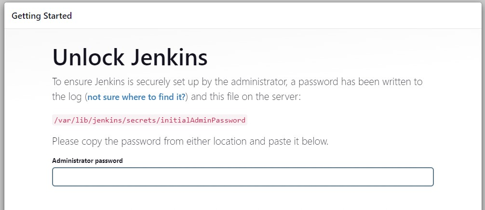
- In your ssh session run cat the file with password by running `sudo cat /var/lib/jenkins/secrets/initialAdminPassword`
- Copy and paste the Admin password in the Jenkins setup screen. This should log you in.
- Click on "Install suggested plugins."
- Setup your Admin account on the next screen.
- Complete the setup until you see the following screen:
  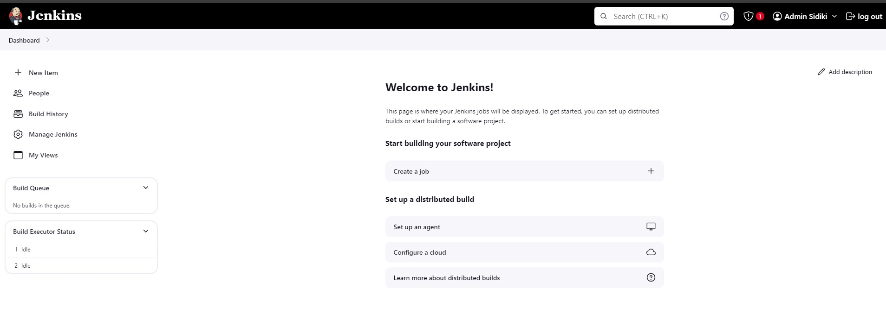
- Click Manage Jenkins > Credentials > Global > Add Credentials.
- Need to add out AWS credentials for jenkins to use for deployments. Do this for both AWS_ACCESS_KEY_ID and AWS_SECRET_ACCESS_KEY:
  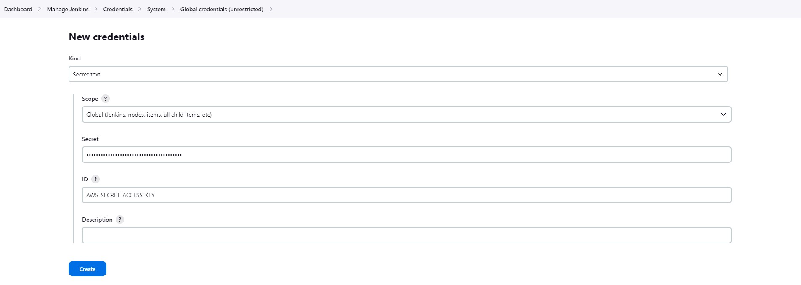
- Add another credentials for git repo login:
  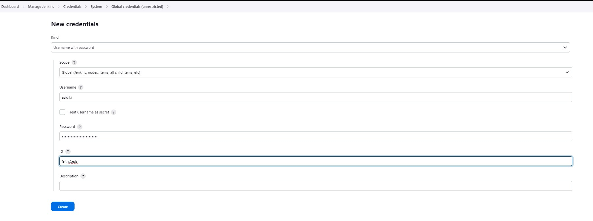

### Edit eksctl_config/cluster_config.yaml:

- In this file edit the subnet information and enter your VPCs private and public subnet IDs. Push changes to your repo.

### Setup EKS Pipeline in Jenkins:

- Click New Item on Jenkins Dashboard and Select Pipeline.
- Scroll down to Pipeline section and change the defition to Pipeline script from SCM, we'll pull the Jenkins pipeline file from our git repo:
  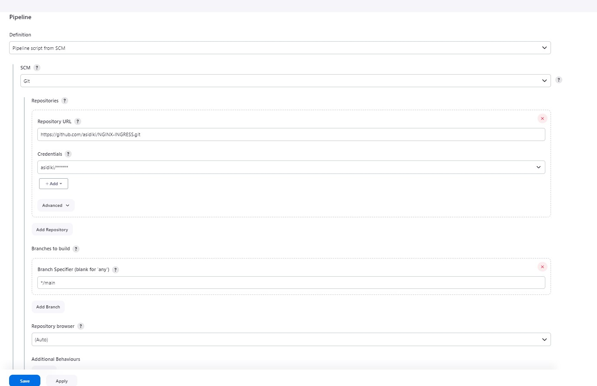
- After creating the pipeline, click build now and wait for the EKS cluster to be built in AWS.

### Setup Kubernetes Access:

- On your Jenkins Server run the following command to define which cluster to use: 
  `aws eks update-kubeconfig --region us-east-1 --name <cluster-name>` 
- Verify access by running `kubectl get all`

### Create Two Basic Nginx Deployments to route our traffic to:

- Take a look at files in /Kubernetes/Deployments. These are the 2 kubernetes definition files for the microservices we will be deploying to route our traffic to. The Pods use the nginx image and apply some basic config using ConfigMaps.
- On the jenkins server, clone your repo to your desired directory.
- Navigate to the Kubernetes/Deployments folder and Run `kubectl apply -f ./service-a.yaml ` and `kubectl apply -f ./service-b.yaml`
- We just deployed these two micro-services in the default namespace.

### Deploy the Nginx Ingress controller:

- Create a new kubernetes namespace by running `kubectl create namespace ingress-nginx`
- We will use Helm to download the Nginx Ingress controller manifest file:

* Add the repo: `helm repo add ingress-nginx https://kubernetes.github.io/ingress-nginx`
* Search the repo for avilable versions: `helm search repo ingress-nginx --versions`

- From the app versions, select the version you want to install:
  `ingress-nginx/ingress-nginx     4.4.0           1.5.1           Ingress controller for Kubernetes using NGINX a...`
- Create Chart Version and App Version Variables:

* `CHART_VERSION="4.4.0"`
* `APP_VERSION="1.5.1"`

- Navigate to Kubernetes/Ingress folder and RUN:
  `helm template ingress-nginx ingress-nginx --repo https://kubernetes.github.io/ingress-nginx --version ${CHART_VERSION} --namespace ingress-nginx > ./nginx-ingress.${APP_VERSION}.yaml`
- This will create a manifest file for us to deploy the nginx controller with. We can go in and see what exactly will be deployed.
- RUN `kubectl apply -f nginx-ingress.${APP_VERSION}.yaml `
- To verify got created successfully run `kubectl get all -n ingress-nginx`, should look like this:
  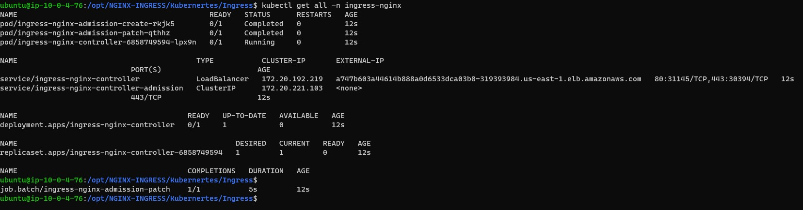
  -Notice the service called ingress-nginx-controller and its "EXTERNAL-IP", thats the URL we can use to access resources within our cluster, if you copy and paste that in your browser you should see the following nginx error page:
  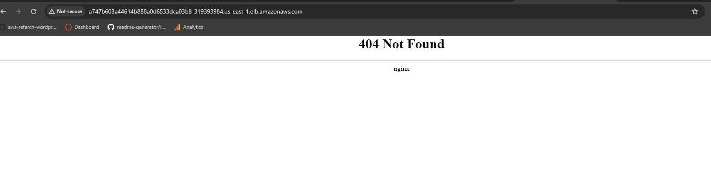

### Create First Ingress:

- Now that we have our ingress controller setup, we need to tell it how to route traffic by creating an ingress. the yaml file located at Kubernetes/Ingress/Ingress.yaml, does that for us. If you look at it, we are defining route based paths to the two nginx microservices we spun up earlier.
- Navigate to the Ingress directory and edit the file and enter the Loadbalancer URL in the 'host' field, without the http://.
  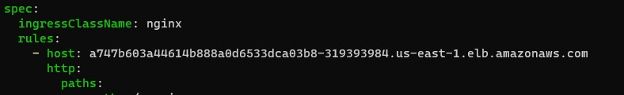
- Run `kubectl apply -f Ingress.yaml` to deploy our first ingress in the default namespace for the two microservives. Note the paths we have provided are URL/servicea and URL/serviceb. Lets test it out in our browser:
  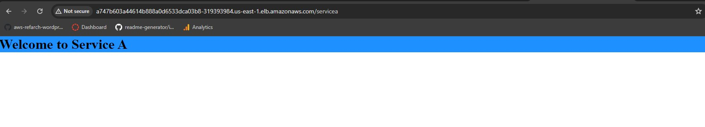 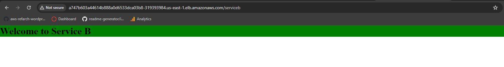
- Congratulations, you have successfully deployed two microservices, the nginx ingress controller and successfully routed traffic to them using path based routing by creating an Ingress in the default namespace.

### Provision EFS Volume:

- Prometheus and Grafana need a persistent volume to run, which the EKS cluster does not have by default.
- We will provision an EFS volume mainly with aws cli on the ssh session we have on our Jenkins Server.

1. Capture your VPC ID - `aws ec2 describe-vpcs`
2. Create a security group for your Amazon EFS mount target
   `aws ec2 create-security-group --region us-east-1 --group-name efs-mount-sg --description "Amazon EFS for EKS, SG for mount target" --vpc-id identifier for our VPC (i.e. vpc-1234567ab12a345cd)`
3. Add rules to the security group to authorize inbound/outbound access `aws ec2 authorize-security-group-ingress --group-id identifier for the security group created for our Amazon EFS mount targets (i.e. sg-1234567ab12a345cd) --region us-east-1 --protocol tcp --port 2049 --cidr <VPC CIDR BLOCK(eg: 192.168.0.0/16)>`
4. Create an Amazon EFS file system `aws efs create-file-system --creation-token creation-token --performance-mode generalPurpose --throughput-mode bursting --region us-east-1 --tags Key=Name,Value=MyEFSFileSystem --encrypted`
5. Capture VPC subnets where the EKS cluster nodes are running `aws ec2 describe-instances --filters Name=vpc-id,Values= identifier for our VPC (i.e. vpc-1234567ab12a345cd) --query 'Reservations[*].Instances[].SubnetId'`
6. Create mount targets in each subnet that was returned by the above query `aws efs create-mount-target --file-system-id identifier for our file system (i.e.fs-123b45fa) --subnet-id identifier for our node group subnets (i.e. subnet-1234567ab12a345cd) --security-group identifier for the security group created for our Amazon EFS mount targets (i.e. sg-1234567ab12a345cd) --region us-east-1`. Create for the first subnet and then run it again with subnet id for the second and third subnets if you have them.
7. Create an Amazon EFS access point `aws efs create-access-point --file-system-id identifier for our file system (i.e. fs-123b45fa) --posix-user Uid=1000,Gid=1000 --root-directory "Path=/jenkins,CreationInfo={OwnerUid=1000,OwnerGid=1000,Permissions=777}"`
8. This completes creating the EFS volume that we will use as a persistent volume for our EKS cluster. Be sure to record the fs id and fsap id when the resources get created.

### Deploy the Amazon EFS CSI driver and Persistent Volume to your Amazon EKS cluster:

1. Deploy the Amazon EFS CSI driver to your Amazon EKS cluster `kubectl apply -k "github.com/kubernetes-sigs/aws-efs-csi-driver/deploy/kubernetes/overlays/stable/?ref=master"`

- Output: `daemonset.apps/efs-csi-node created csidriver.storage.k8s.io/efs.csi.aws.com created`

2. Create the Monitoring namespace in our cluster `kubectl create namespace monitoring`
3. Navigate to the Kubernetes/PersistentVolume. These files create a storageclass, a persistent volume and a persistent volume claim on our EKS cluster. Before we deploy, edit the persistentvolume.yaml and enter your values for fs-id and fsap-id into the volumeHandler field in this format: `fs-123b45fa::fsap-12345678910ab12cd34`.
4. StorageClass, PersistentVolume and PersistentVolumeClaim are all namespace resources, we will deploy these resources in the Monitoring namespace: `kubectl apply -f storageclass.yaml,persistentvolume.yaml,persistentvolumeclaim.yaml -n monitoring`
5. Ensure the resources were created `kubectl get sc,pv,pvc`

### Deploy Prometheus:

- We will deploy Prometheus using Helm.
- Add the prometheus-community chart repo `helm repo add prometheus-community https://prometheus-community.github.io/helm-charts`
- Deploy Prometheus `helm upgrade -i prometheus prometheus-community/prometheus --namespace monitoring --set alertmanager.enabled=false,server.persistentVolume.existingClaim="efs-claim"` - Notice how we are defining a PV claim for prometheus to use is what we had created in our persistingvolumeclaim.yaml file.
- Verify all pods are running `kubectl get all -n monitoring`
- Make sure you capture the Prometheus server access URL in the notes that show up, we will need this URL to setup grafana:
  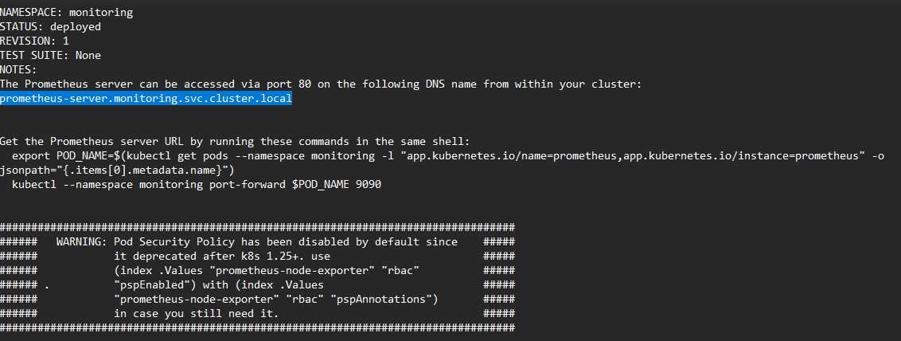

### Deploy Grafana and Ingress:

- We will again deploy Grafana using Helm and use the same EFS PV in the monitoring namespace.
- Navigate to /Kubernetes/Grafana, the file in here are value we will provide for the Grafana helm chart.
- Deploy Grafana `helm install grafana grafana/grafana --namespace monitoring --set adminPassword='Y0urChoic3' --values ./values.yaml`
- Now we deploy an Ingress, telling the nginx ingress controller to route traffic to Grafana in the monitoring namespace.
- Navigate to Kubernetes/Ingress and edit the file with the URL of your Nginx Ingress Controller LoadBalancer. Also notice the field `nginx.org/mergeable-ingress-type: "minion"`, this is what tells the Nginx Ingress Controller that this is a secondary ingress and be in a different namespace.
- Deploy the Ingress `kubectl apply -f monitoringIngress.yaml -n monitoring`
- Paste the url in your browser with a / at the end, you should see the grafana front end:
  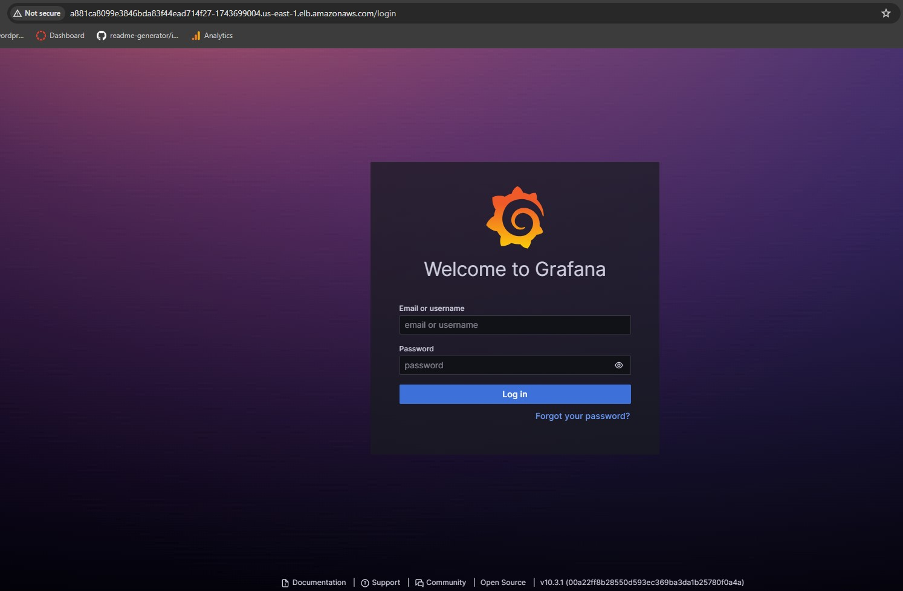

### Setup Grafana:

- Login with the password you set for grafana while deploying, username will be admin.
- Click on "Add your first data source"
  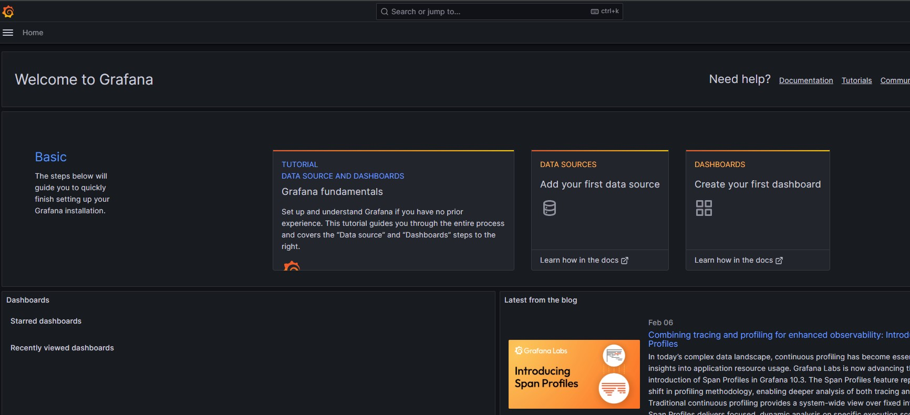
- Select Prometheus.
- In the connection section, add the Prometheus server URL that we captured earlier:
  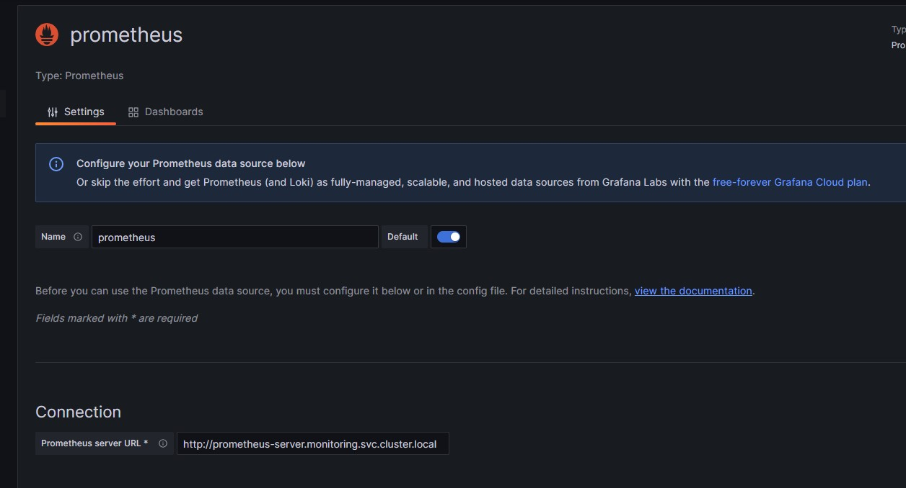
- Click save and test at the end of the page.
- Go to Grafana home and click Create your first Dashboard.
- Click Import Dashboard
- Visit https://grafana.com/grafana/dashboards/ to find the dasboard that fits your needs, eg: https://grafana.com/grafana/dashboards/6417-kubernetes-cluster-prometheus/
- Click on Copy ID to clipboard on the right.
- Back in Grafana, paste the ID in import dashboard textbox and click Load and then Import on the next page:
  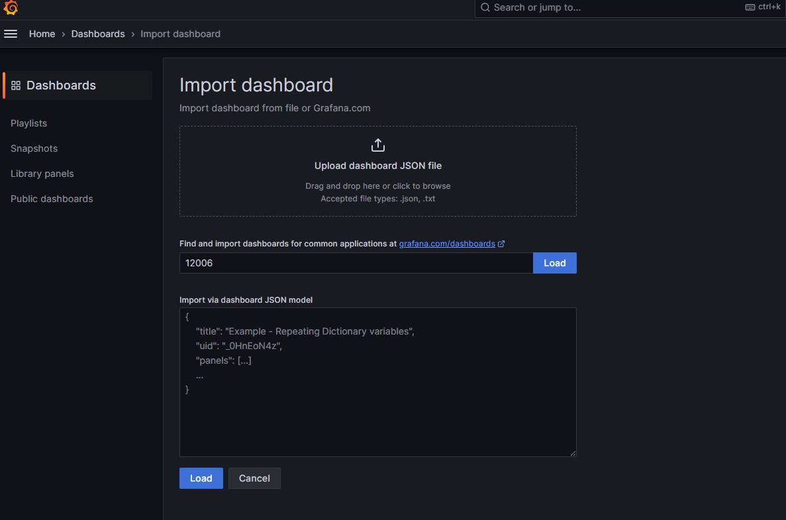
- And this imports a preconfigured dashboard for the Kubernetes Cluster, you can have multiple dashboards and also create your own:
  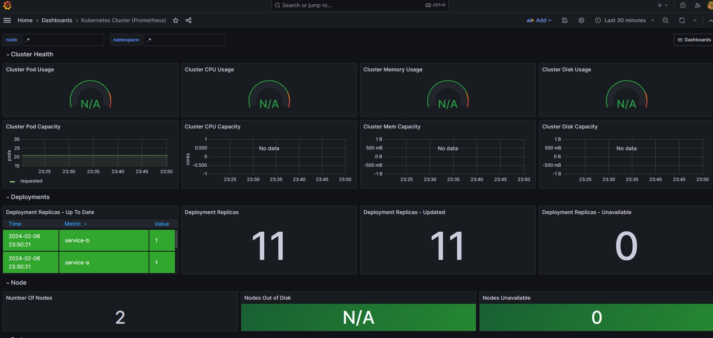

### Conclusion

- In this project we were able to deploy the VPC infrastructure using Terraform, which also spun up our Jenkins Server on an Ec2 using an Ubuntu Image. The server had a bootstrap script that installed all the tools like jenkins, kubectl, eksctl, helm etc for us.
- We leveraged Jenkins to deploy our EKS cluster using `eksctl` into our existing VPC.
- After we had the EKS cluster deployed, we spun up two basic nginx webapps as microservcies in the default namspace.
- We then deployed Nginx Ingress Controller in the ingress-nginx namespace and created our first ingress to route to the nginx webapp microservices in default namespace.
- We then provisioned a EFS volume and attached it to the EKS cluster as a Persistent Volume.
- Next, we deployed prometheus and grafana in the monitoring namespace and used the Persistent Volume as storage for these services.
- We also routed traffic to the Grafana service using the Nginx Ingress Controller, this traffic is going across namespaces to the monitoring namespace which is different than the first ingress we created for the default namespace.
- Lastly, we configured Grafana and added Prometheus as a Data Source. Imported a dashboard and were able to successfully pull in cluster metrics.
- This is the easiest way to get a EKS cluster up and going in a very short amount time with Ingress and Observability enabled. Hope you find this helpful.

**ansab@sidiki.io**
